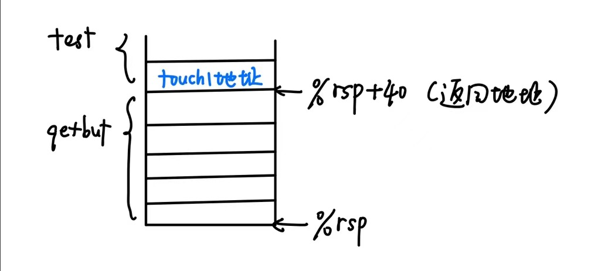
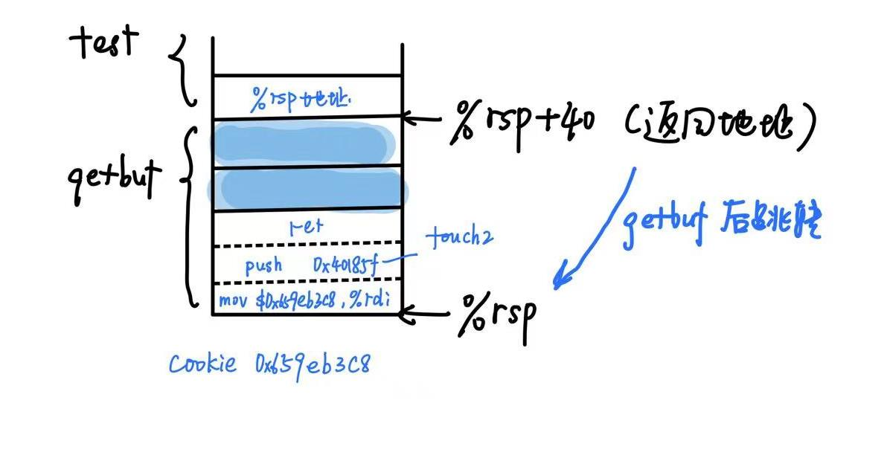
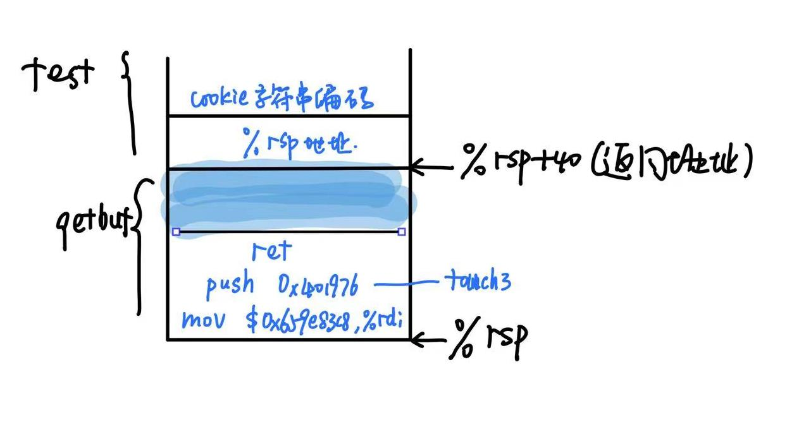
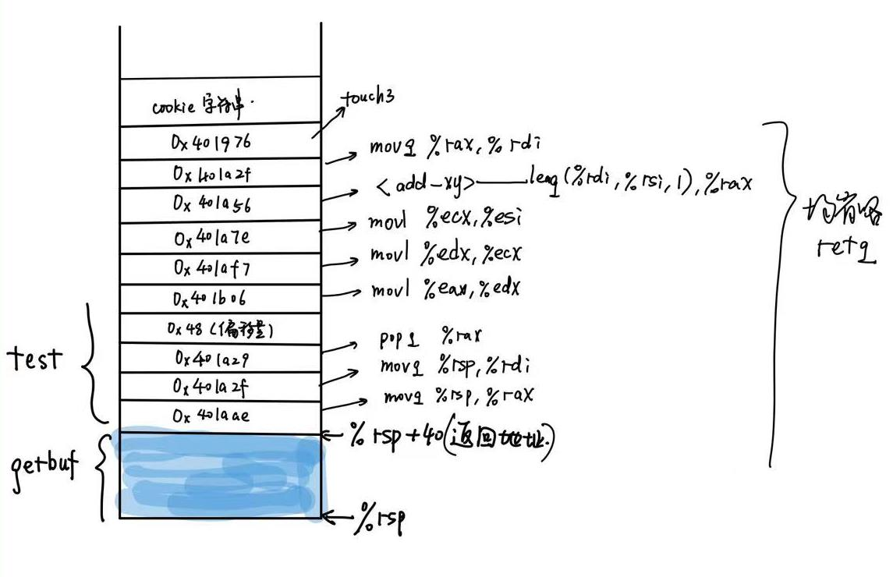

# AttackLab

祝尔乐 2020013020

#### 1.实验目的

* 了解攻击者在程序不支持的情况下利用安全漏洞的不同方式，学习如何保护自己的程序免受此类攻击，编写更安全的程序。
* 深入了解x86-64的堆栈和参数传递机制及指令编码方式
* 学习使用$GDB$和$objdump$等调试工具

#### 2.实验原理

* **缓冲区溢出**

  C在调用函数读取字符串时，栈中会分配某个字符数组来保存一个字符串，但是如果缺乏保护的话，字符串的长度超出了为数组分配的空间，这就会干扰我们源程序的运行，甚至产生严重地破坏。

* **代码注入攻击CIA**（phase2,3)

  C在调用call label的时候，会先把下条指令的地址$Return\ Address$压入栈中，如果我们将字符串设计为超出栈预设长度、且在返回地址的位置设置一个新的地址，覆盖原来的地址，那么函数就会返回到我们设定的位置，执行命令。如果将位设为栈顶位置，那么函数将会执行栈顶后的指令，我们将代码转化为16进制指令存放在相应的位置，就可以实现“插入代码”的功能。

* **保护机制**

  缓冲区溢出攻击的普遍发生给计算机系统造成了许多麻烦。现代的编译器和操作系统实现了许多机制，以避免遭受这样的攻击，限制入侵者通过缓冲区溢出攻击获得系统控制的方式。

  * **栈随机化**

    栈随机化的思想使得栈的位置在程序每次运行时都有变化。因此，即使许多机器都运行同样的代码，它们的栈地址都是不同的。

  * **栈破坏检测**

    最近的GCC版本在产生的代码加入了一种栈保护者机制，来检测缓冲区越界。其思想是在栈帧中任何局部缓冲区和栈状态之间存储一个特殊的金丝雀值。在恢复寄存器状态和从函数返回之前，程序检查这个金丝雀值是否被该函数的某个操作或者该函数调用的某个操作改变了。如果是的，那么程序异常中止。

  * **限制可执行代码区域**

    消除攻击者向系统中插入可执行代码的能力。一种方法是限制哪些内存区域能够存放可执行代码。

* **面向返回的攻击**(phase4,5) 

  在ROP攻击中，因为栈上限制了不可插入可执行代码，所以不能像phase2,phase3那样直接在栈上插入代码。所以我们需要在已经存在的程序中找到特定的指令序列，并且这些指令是以ret结尾，这一段指令序列，我们称之为gadget。利用gadget,我们可以借刀杀人，用源程序中的“指令”来进行攻击。

#### 3.实验过程

* **phase1**

  通过

  ```objdump
  objdump -s ctarget > ctarget.s
  ```

  对ctarget进行反汇编，观察ctarget.s文件，看到栈为buf分配了$0x28$，也就是40个字节，再找到<touch1>的起始位置0x401831,于是我们构造字符串的时候就先填充40个00字符，再在40-48的位置填入touch1的地址（八位）。

  画出读入字符后的栈帧图如下：

* **phase2**

  在ctarget.s中进行查找，找到<touch2>的地址0x40185f以及栈顶寄存器%rsp的地址0x556120f0，以及由输出信息知道cookie的值为0x659eb3c8。本部分我们需要插入代码，先将插入的代码写进inject2.s:

  ```gas
   1 # inject codes of CIA-L2
    2
    3 movq    $0x659eb3c8, %rdi   # cookie --> rdi
    4 pushq   $0x40185f   # call touch2
    5 ret
  ```

  然后我们使用gcc -c指令将inject2.s其转化为inject2.o文件，再用objdump -d看到该指令的16进制表示：

  ```gas
  48 c7 c7 c8 b3 9e 65    mov    $0x659eb3c8,%rdi
  68 5f 18 40 00          pushq  $0x40185f
  c3						retq
  ```

  于是我们输入的字符串的成分为：

  **代码对应的指令（<test>返回到%rsp地址会时执行） + 补齐字符（到40）+ %rsp地址**

  画出读入字符串后的栈帧图像：

  

* **phase3**

  本部分我们要调用touch3,并传入cookie十六进制表示的字符串“659eb3c8\0”。

  查阅ASCII码表我们可以知道cookie十六进制表示对应的十六进制编码为

  ```
   36 35 39 65 62 33 63 38 00	#00代表'/0'
  ```

  本部分的基本思路分为两部分，第一部分为调用<touch3>的方式，我们沿用第二问的方式，只需将<touch2>的地址改为<touch3>的地址。第二部分为如何将参数传入touch3，这里和第二问不太一样，我们要传入的是cookie字符串，参数应该是字符串的首地址。

  cookie字符串可选择的位置比较多，我们选择放在getbuf返回地址的后面，也就是%rsp初始地址+8的位置。

  于是我们输入的字符串有以下几部分组成：

  **代码对应的指令（<test>返回到%rsp地址会时执行）+ 补齐字符 + %rsp地址 + cookie字符串编码**

  画出读入字符串后的栈帧示意图:

* **phase4**

  本部分我们需要利用gadget来帮助我们实现攻击。

  我们把cookie存在栈中，利用gadget中的代码将cookie从栈上弹出，再将cookie传入%rdi,再调用<touch2>。

  这里我们不必直接push<touch2>的地址，因为我们所找的gadget都是会ret的，只需将<touch2>的地址放在相应的语句后面即可。

  我们需要的代码为：

  ```gas
    1 popq    %rax	# 将cookie弹出
    2 movq    %rax, %rdi	# cookie赋值给%rdi,作为<touch2>的参数
  ```

  将代码转换为十六进制指令后为：

  ```gas
  58                      pop    %rax
  48 89 c7                mov    %rax,%rdi
  ```

  我们在rtarget中的<start_farm>到<mid_farm>中寻找指令为s+nop*n+ret(s为目标指令)的代码地址，放在字符串中，程序每次执行完ret后，都会进入栈中gadget相应地址，如此往复，便可以实现多条指令的依次执行。

  在rtarget.S中寻找相应指令对应的地址，放入输入字符串的对应位置。

  于是本题字符串组成为：

  **占位符（40） +  pop代码地址 + cookie值 + mov代码地址 + touch2地址**

  画出读入字符串后的栈帧图像：

  

* **phase5**

  本阶段实现的功能与phase3相同——把cookie字符串的地址传入%rdi,然后调用<touch3>。

  目前最难的点就是如何计算出cookie字符串的地址，并且把cookie放到该位置。

  cookie字符串的位置 = getbuf的返回地址 + 计算出它的地址所需要的指令的地址偏移量

  涉及到地址计算，我们必须需要在gadget中找到有相关功能的指令。

  

  <add_xy>似乎就是为本阶段所准备的。

  我采用的地址获取方式是：

  * 获取%rsp地址——movq %rsp,%rax

  * 将%rax的内容传送到%rdi——movq %rsp,%rdi

  * 将偏移量的内容弹出到%rax——popq %rax

    偏移量：加上偏移量自己的储存空间一共$8 \times 9 = 72 = 0x48$位。

  * 将%eax的内容（0x48)传送到%edx——movl %eax，%edx

  * 将%edx的内容传送到%ecx——movl %edx, %ecx

  * 将%ecx的内容传送到%esi——movl %ecx, %esi

    (这里遇到了一点小困难，稍后再叙)

  * 将栈顶 + 偏移量得到字符串的首地址传送到%rax——<add_xy>

  * 将字符串首地址%rax传送到%rdi——movq %rax, %rdi

  输入字符串为

  **占位符 + gadget指令地址 + <touch3>地址 + cookie字符串**

  画出插入字符串后的图像：

  按照设定的代码逐步执行，就能顺利调用<touch3>,匹配字符串。

#### 4.困难与收获

* 第一个困难是cookie的字符串应该如何表示，是否有前缀”0x",是否有尾部’\0'，我在不断尝试和错误中寻找答案，最终在网站上找到了正确的表示方法，解决了问题。

* 第二个困难是phase5中如何把从栈下pop出来的cookie值（储存在%rax中)转移到%rsi中。

  最朴素的想法是

  ```gas
  movl %eax, %esi
  ```

  结果我发现rtarget并没有给我提供合适的gadget！

  遂改成：

  ```gas
  movl %eax, %ecx
  movl %ecx, %esi
  ```

  未果。

  ```gas
  movl %eax, %edx
  movl %edx, %esi
  ```

  未果。

  最终将代码修改为三次转移才找到合适的gadget，这里非常消耗时间，但是看到PASS,还是很有成就感的。

* 收获有很多，如linux的各种操作，gdb,onjdump的一些指令，以及对程序栈更深入的理解。

  和同学交流后，发现他们还有其他的方法实现phase5，感觉非常有趣，也让我对编译器的工作有了初步的体验。

##### 参考资料

《深入理解计算机系统》，CMU；

[Recitation 5: Attack Lab and Stacks (panopto.com)](https://scs.hosted.panopto.com/Panopto/Pages/Viewer.aspx?id=60c65748-2026-463f-8c57-134fd6661cdf)


